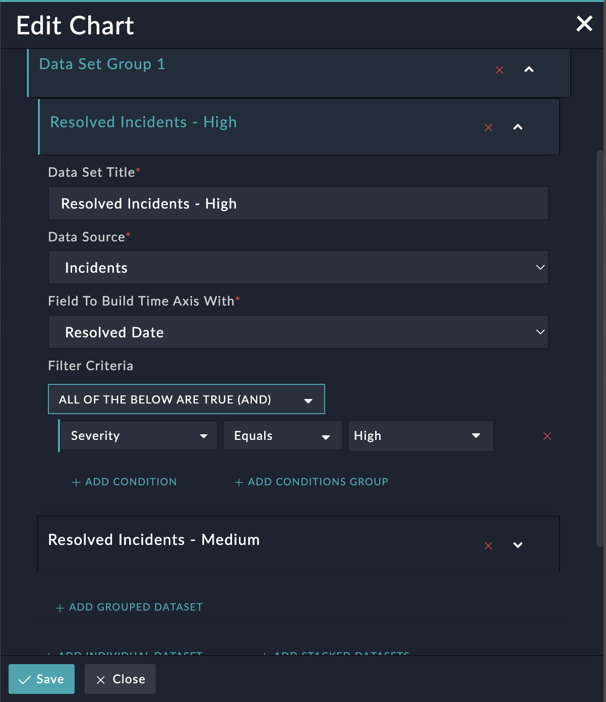

| [Home](../README.md) |
|--------------------------------------------|

# Installation

1. To install a solution pack, click **Content Hub** > **Discover**.
2. From the list of widgets that appears, search for and select **Time Series Charts**.
3. Click the **Time Series Charts** widget card.
4. Click **Install** on the bottom to begin installation.

## Prerequisites

The **Time Series Charts** widget relies on the contents of the **Time Series Charts** solution pack, which includes a corresponding connector, module, and playbook collection in addition to this widget. If you have installed this widget independently from Content Hub, please install the **Time Series Charts** solution pack to ensure proper functionality.

# Configuration

Provide the following details to customize the **Time Series Charts** widget to suit your requirements:

| Fields     | Description                              |
| ---------- | ---------------------------------------- |
| Title      | Specify the title of the rendered chart. |
| Time Axis View (X) | Specify the duration of the "buckets" into which to group the events on the rendered chart (For example Hourly, Daily, etc.) and the time span which the chart will cover (for example "in the last 7 days", "in the last  3 months", etc.) |

For each data set (whether individual or as a part of a data set Group), following additional details may be customized:

| Fields                                                 | Description                                                                                                                                                                                                                                                                                                                                 |
|--------------------------------------------------------|---------------------------------------------------------------------------------------------------------------------------------------------------------------------------------------------------------------------------------------------------------------------------------------------------------------------------------------------|
| Data Set Title                                         | Specify the title of the rendered chart                                                                                                                                                                                                                                                         |
| Data Source                                            | Specify the module to query for this data set                                                                                                                                                                                                                                                                                          |
| Plot Type                                              | Specify the plot type ofß the resulting chart. For example Bar, Line, Scatter, etc.                                                                                                                                                                                                                                          |
| Field to Build Time Axis With                          | Specify the field in the corresponding module to plot each record's place on the chart's X-Axis                                                                                                                                                                                                                                          |
| Group Results By (optional, individual data sets only) | Specify the field to break up the results of this data set's query into separate representations (bars, scatter point groups, etc) for each value in the picklist field. For example setting this to *Severity* will result in separate representations for "High", "Medium", and "Low" in the resulting chart. |
| Filter Criteria                                        | Specify the filters to determine which records from the chosen module are represented in this data set                                                                                                                                                                                                                                  |

Once configured, the Edit Widget interface will look similar to the following screenshots:

| [Usage](./usage.md) |
|--------------------------|
