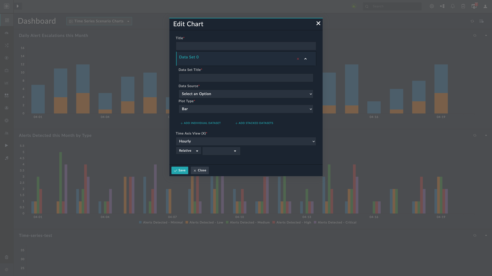

| [Home](../README.md) |
|--------------------------------------------|

# Usage

When a new instance of the Time Series Charts Widget is configured, a record is created in the Time Series Charts module. This record contains the queries defined in the Widget's data sets, and has an additional field to store the query results.

This record's creation triggers a playbook from the Time Series Charts Solution Pack, which processes the configuration data into a set of query payloads.
Typically, each data set has one query payload for each time window in the span configured in the Widget.

The playbook runs all necessary queries, and saves the results in the corresponding module record. After saving, the widget shows the results rendered into a chart as per the widget's configuration.

Once the chart has been initialized, periodically running the queries keeps the chart up-to-date. You can create a schedule to execute the **Update All Time Series Charts** playbook included in the **Time Series Charts** solution pack.

## Time Series Chart Widget Edit View

This section details the process to edit the widget and use it with data from a module and other time customizations.

1. Edit a module's view template (e.g. *Dashboard*) and select **Add Widget** button.

2. Select **Time Series Charts** from the list to bring up the **Time Series Chart** widget's customization modal.

3. Specify the title of the Time Series chart in the **Title** field.

    

4. Select from the following options:

    1. [Add Individual Dataset](#add-individual-dataset)

    2. [Add Stacked Datasets](#add-stacked-datasets)

5. Specify the duration of the "buckets" into which to group the events on the rendered chart. You can choose from the following options:

    1. Hourly

    2. Daily

    3. Weekly

    4. Monthly

    5. Quarterly

    6. Yearly

6. Specify the time span for the chart to cover. For example, last 3 months, Next 7 days, etc. You can also choose custom to define your preferred time span.

7. Click **Save** to save the changes.

### Add Individual Dataset

1. Click **+ Add Individual Dataset**.

2. Click to expand the data set. The name is of the format `Data Set <number>`.

3. Specify the title of the data set in the **Data Set Title** field.

4. Select a module as the data source in the **Data Source** drop-down.

5. Select a **Plot Type** from the following options:

    1. Bar

    2. Line

    3. Spline

    4. Step

    5. Area

    6. Scatter

>**NOTE**: To add more data sets to the chart, click **+ Add Individual Dataset** and repeat the preceding steps.

### Add Stacked Datasets

1. Click **+ Add Stacked Datasets**.

2. Click to expand the data set group. The name is of the format `Data Set Group <number>`.

3. Click **+ Add Grouped Dataset**

4. Click to expand the data set. The name is of the format `Data Set <number>`.

5. Specify the title of the data set in the **Data Set Title** field.

6. Select a module as the data source in the **Data Source** drop-down.

>**NOTE**: To add more data sets to the chart, click **+ Add Stacked Datasets** or **Add Grouped Dataset** and repeat the preceding steps.
